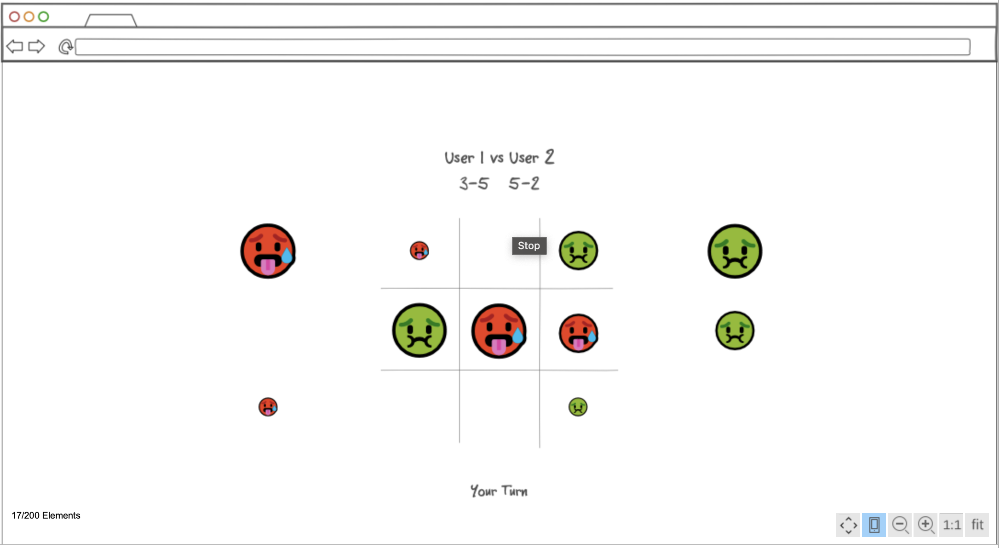

# Advanced TicTacToe Online

## Description deliverable

### Elevator pitch

Have you everwished TicTacToe was a more compelling competitive experience? Advanced TicTacToe online provides a more advanced version of TicTacToe, with compelling gameplay and online multiplayer functionality. Every turn is saved to the  online  server, so  players can leave and comeback to take their turn when convinient.

### Design

### Key features

- Secure login over HTTPS
- Ability to select color of pieces
- Ability to leave and come back later to finish the game
- Updates opponents moves in real time
- Option to forfeit
- Win Lose record saved by the  server

### Technologies

I am going to use the required technologies in the following ways.

- **HTML** - Uses correct HTML structure for application. Three HTML pages. One for login, one for selecting game, one for gameplay.
- **CSS** - Application styling that looks good on different screen sizes, uses good whitespace, color choice and contrast.
- **JavaScript** - Provides login, game display, changing color, display other users moves.
- **Service** - Backend service with endpoints for:
  - login
  - retrieving opponent moves
  - submitting moves
  - retrieving win lose record
- **DB** - Store users, win loss record, and moves in database.
- **Login** - Register and login users. Credentials securely stored in database. Can't play unless authenticated.
- **WebSocket** - As each user plays, their moves are updated to other player.
- **React** - Application ported to use the React web framework.

### HTML deliverable

- **HTML pages** - Two HTML pages for login, game select, and playing.
- **Links** - Login page links to game select, game select links to play.
- **Text** - Game selection represented by textual description
- **Service Calls** - Javascript will handle the game code on the play page
- **Images** - One image of a tic tac toe board included
- **Login** - Input box and submit button for login
- **Database** - Game information represents database information
- **WebSocket** - Realtime game information will be updated through web socket

### CSS deliverable

- **Header, Footer, and Main** - Distinct style
- **Navigation Elements** - Colors change on hover, no underline 
- **Responsive to Window Resizing** - Header and footer move, and disappear appropriately
- **Application Elements** - Used good contrast, good layout for game select screen
- **Application Text Content**  - Consistent fonts
- **Application Images** - Left unchanged because I'm not sure how the Javascript will fit in yet.

## JavaScript deliverable

- **login** - Saves username for use on future pages
- **database** - Game information and current game status saved in local storage
- **WebSocket** - setInterval function periodically checks for a move from the opponent. This will be replaced with WebSocket later.
- **Application logic** - First turn of the game is fully playable.

## Service deliverable

- **Node.js/Express HTTP service** ✅
- **Static middleware for frontend** ✅
- **Calls to third party endpoints** - Displays quotes on the login page.
- **Backend service endpoints** - Placeholders for retrieving current games and game state from the database and updating the game state at the end of a turn.
- **Frontend calls service endpoints** ✅

## DB deliverable

- **MongoDB Atlas database created** - ✅
- **Endpoints for data** - Endpoints now store and retrieves game data from the database.
- **Stores data in MongoDB** - ✅

## Login deliverable

- **User registration** - Creates a new account in the database.
- **User authentication** - Stores the votes under the same user if the user already exists.
- **Use MongoDB to store credentials** - Stores the user and win loss record.
- **Restricts functionality** - Select and Play screens cannot be accessed unless logged in.
